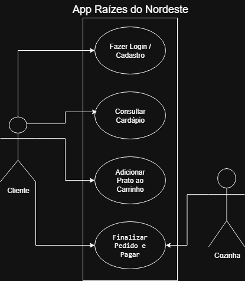

# 🍲 Aplicativo Móvel - Rede Raízes do Nordeste

O presente projeto apresenta a proposta de interface front-end desenvolvida para a rede de restaurantes **"Raízes do Nordeste"**. Diante do crescimento acelerado da empresa, o objetivo deste trabalho foi projetar e documentar um protótipo de alta fidelidade funcional e interativo focado na experiência do usuário (UX/UI), alinhado às regras de negócio e necessidades de multicanalidade da rede.

A solução proposta foi concebida aplicando a metodologia *Mobile First*, garantindo que a interface seja altamente responsiva e otimizada para dispositivos móveis e totens de autoatendimento.

---

## 📋 1. Análise e Requisitos

Mapeamento das funcionalidades essenciais (Requisitos Funcionais) e as restrições de infraestrutura, segurança e desempenho (Requisitos Não Funcionais) para solucionar o problema de obsolescência tecnológica da marca.

### ⚙️ Requisitos Funcionais (RF)
* **RF01 - Consentimento Obrigatório da LGPD:** O sistema só deve permitir que o usuário avance da tela inicial para o fluxo do aplicativo após o aceite explícito dos Termos de Privacidade via checkbox.
* **RF02 - Validação Completa de Cadastro:** A interface deve validar todos os campos do formulário de criação de conta (Nome, Telefone, E-mail, Senha). Caso haja campos vazios, o sistema exibe a tela de erro específica (`Cadastro/erro`).
* **RF03 - Seleção de Unidade e Sincronização de Estoque:** O sistema deve obrigar a escolha de uma filial da rede (Centro, Shopping ou Praia). Itens esgotados no estoque têm o botão de clique bloqueado.
* **RF04 - Gerenciamento do Carrinho de Compras:** O usuário deve ser capaz de gerenciar os produtos selecionados (preços, quantidades e valor total) antes de fechar o pedido.
* **RF05 - Validação do Endereço de Entrega:** No fluxo de finalização, o sistema valida se todos os campos obrigatórios de endereço foram digitados, bloqueando o avanço se houver pendências.
* **RF06 - Seleção Obrigatória de Forma de Pagamento:** A interface de checkout impede a confirmação do pedido sem que uma das formas de pagamento (PIX, Cartão ou Dinheiro) esteja ativamente selecionada.
* **RF07 - Fluxo de Checkout Pix e Acompanhamento:** O sistema gera a simulação do pagamento com QR Code de PIX fictício e exibe a tela de sucesso integrada com a barra de progresso do status (`Acompanhar Pedido`).
* **RF08 - Painel do Programa de Fidelidade:** O sistema exibe na tela de perfil o saldo atualizado de pontos acumulados na rede e a opção de resgatar ofertas.

### 🛡️ Requisitos Não Funcionais (RNF)
* **RNF01 - Abordagem Mobile First e Restrições de Layout:** Interface projetada prioritariamente para smartphones, garantindo componentes adaptáveis para totens de autoatendimento.
* **RNF02 - Tratamento de Erros e Usabilidade (UX):** Feedback visual instantâneo e amigável (telas de erro dedicadas) sempre que uma regra de preenchimento for violada.
* **RNF03 - Conformidade com a LGPD:** O fluxo lógico respeita a privacidade por padrão (*Privacy by Design*), coletando apenas os dados estritamente necessários.
* **RNF04 - Desempenho em Horários de Pico:** Estrutura de navegação e validação otimizada para carregamento rápido, visando evitar filas nos totens físicos nos horários de pico.

---

## 📐 2. Modelagem e Arquitetura

### 🔗 Especificação do Caso de Uso: Realizar Pedido (UC01)

| Item | Especificação |
| :--- | :--- |
| **Caso de Uso** | UC01 - Realizar Pedido de Ponta a Ponta com Validações |
| **Ator Principal** | Cliente / Usuário do Aplicativo |
| **Pré-condições** | O cliente deve abrir o aplicativo móvel e aceitar os termos da LGPD na tela inicial. |
| **Fluxo Principal** | 1. O cliente aceita os termos da LGPD. 2. O cliente realiza o Cadastro ou Login. 3. Seleciona a unidade/filial desejada. 4. O sistema carrega o cardápio e o cliente seleciona os produtos. 5. O cliente acessa o Carrinho para revisar itens e quantidades. 6. Preenche os dados de Endereço para entrega. 7. Seleciona a forma de Pagamento e confirma o pedido. 8. O sistema gera o QR Code do PIX e exibe a tela de Acompanhamento do Pedido. |
| **Fluxos Alternativos / Exceções** | **A1 [Erro no Cadastro]:** Se deixar campos obrigatórios vazios, o sistema exibe a tela `Cadastro/erro`. **A2 [Item Esgotado]:** Se o item selecionado estiver sem estoque na unidade, o sistema desativa o card e exibe "INDISPONÍVEL". **A3 [Erro no Endereço]:** Se não preencher todos os dados de entrega, o sistema bloqueia e exibe a tela `Endereço/erro`. **A4 [Pagamento Não Selecionado]:** Se não marcar uma forma de pagamento, o botão permanece inativo. |
| **Pós-condições** | O pedido é registrado com sucesso e os pontos correspondentes são calculados para o Programa de Fidelidade. |

### 📊 Diagrama de Casos de Uso (UML)

---

## 🧪 3. Plano de Testes de Software

* **Caso de Teste 01 (CT01) - Validação de Cadastro Obrigatório:** Tentar avançar na tela de registro deixando campos em branco. **Resultado Esperado:** Bloqueio do avanço e exibição da tela `Cadastro/erro`.
* **Caso de Teste 02 (CT02) - Bloqueio de Itens Indisponíveis:** Tentar clicar em um produto esgotado no estoque da unidade física. **Resultado Esperado:** O botão deve estar inativo e apresentar a marcação `INDISPONÍVEL`.
* **Caso de Teste 03 (CT03) - Validação de Endereço de Entrega:** Tentar avançar para o checkout sem preencher o endereço de entrega por completo. **Resultado Esperado:** Botão continuar bloqueado direcionando para a tela `Endereço/erro`.
* **Caso de Teste 04 (CT04) - Seleção Obrigatória de Pagamento:** Tentar clicar em Confirmar Pedido sem selecionar o método de pagamento. **Resultado Esperado:** Impedir a finalização e manter o botão desativado até a seleção.

---

## 🎨 4. Protótipo de Alta Fidelidade (Figma)

O desenvolvimento deste projeto permitiu aplicar na prática os conceitos de Engenharia de Software e Design de Interface (UI/UX) focados nas necessidades do cliente final da rede.

🔗 **[Clique aqui para acessar o protótipo interativo no Figma](https://www.figma.com/design/zjUl3mMih30mxMNpAcEPWo/Projeto-Multidisciplinar---Ra%C3%ADzes-do-Nordeste?node-id=8-38&t=9sRGsSO6wJmQvfnp-1)**

---
*Projeto desenvolvido por Caio Vitor Alves Soares (2026).*
